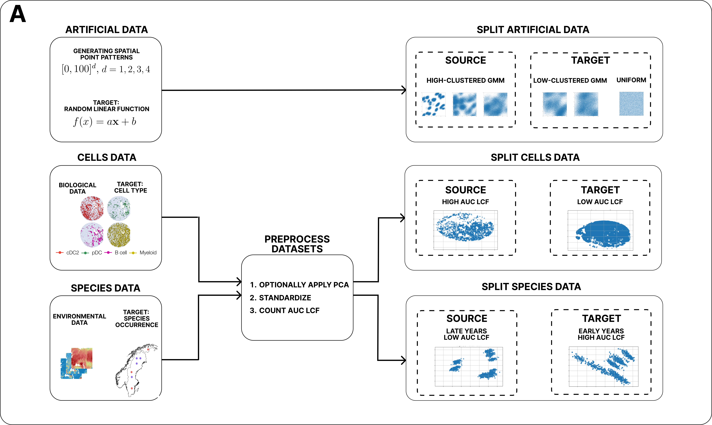
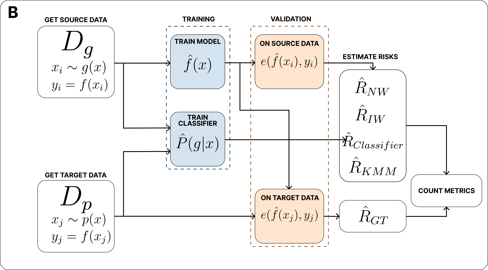

# Importance Reweighting for High-Quality Validation of Data-Based Models

This project provides a systematic evaluation of reweighting methods for the accurate risk estimation (error assessment) of machine learning models under spatial distribution shift. This is critically important when training (source) and target data exhibit different spatial characteristics, a common scenario in ecological, biomedical, and other geospatial domains.

The core focus is on comparing classical approaches like **No Weighting (NW)** and **Importance Weighting (IW)** with more advanced methods, including **Kernel Mean Matching (KMM)** and classifier-based reweighting. The findings demonstrate that KMM offers significantly more reliable and accurate risk estimates, especially for high-dimensional and highly clustered data, by avoiding the instability issues inherent in other methods.

## Workflow

The overall experimental workflow is divided into two parts: data preparation and validation.

**Part A** illustrates how artificial and real-world datasets (cells and species) are constructed and prepared, defining source and target domains, and performing preprocessing steps like normalization and LCF-based splitting.



**Part B** demonstrates the validation pipeline used across all dataset types: a model is first trained on the source data, then a domain classifier is trained, and finally, performance is evaluated on the target data using various risk estimation methods.



## Requirements

*   Python **3.11.10** (as specified in `pyproject.toml`)
*   [Poetry](https://python-poetry.org/) for dependency management.
*   [Nox](https://nox.thea.codes/) for task automation and execution.

## Installation

1.  **Clone the repository:**
    ```bash
    git clone https://github.com/awesomeslayer/Importance-reweighting-methods-for-high-quality-validation.git
    cd Importance-reweighting-methods-for-high-quality-validation
    ```

2.  **Set up the Python version:**
    Ensure your active Python version matches the project's requirement (`3.11.10`). If you use `pyenv` (recommended):
    ```bash
    pyenv local 3.11.10
    ```
    Alternatively, tell `poetry` to use the correct executable:
    ```bash
    poetry env use python3.11
    ```

3.  **Install dependencies:**
    This command will install all necessary packages from the `poetry.lock` file, ensuring a fully reproducible environment.
    ```bash
    poetry install
    ```

## Usage

This project uses `Nox` to run all primary tasks.

#### Running the Main Application

To run the main experiment as described in the paper (executing `main/main.py`), use the following `nox` session:
```bash
nox -s poetry_run
```
